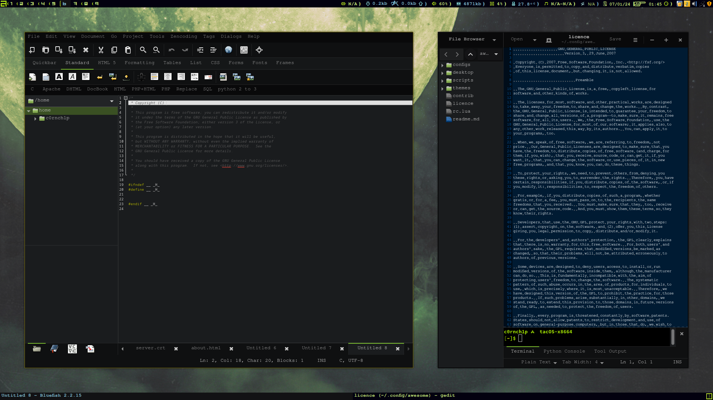
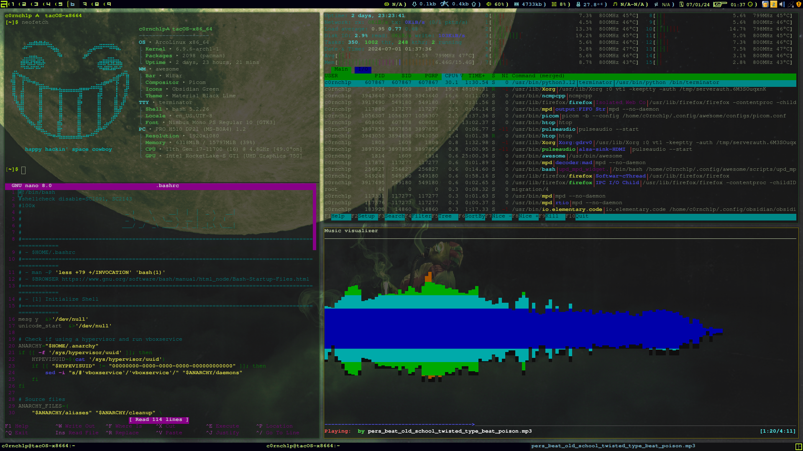
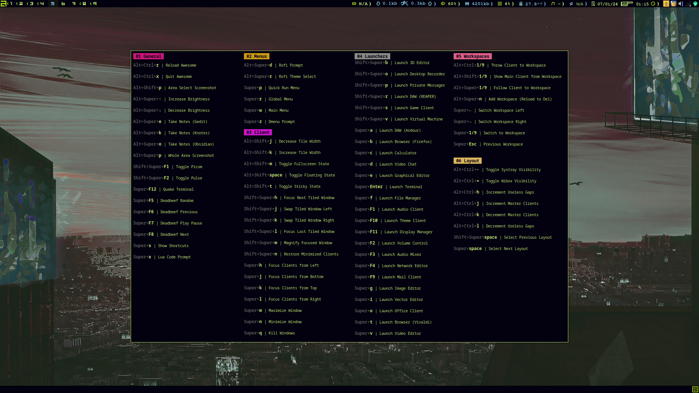

##
#### TacOS AwesomeWM Config
##
##### Overview
This Awesome config aims to provide a fully functional and visually acceptable setup out
of the [(taco)](https://cdn0.woolworths.media/content/wowproductimages/large/228151.jpg)
box. It features an extensive set of launchers and other shortcuts for client management,
a nicely styled theme with a custom icon set, and a variety of system menus and widgets.
Custom configs are included for autostart applications like Picom, and shell scripts have
been integrated with the Lua code for handling temperamental systems like Pulse (Pipe is
also installed on TacOS, it will see future builtin support).
##### Programs



##### Terminals



##### Installation
The installation of dependencies and initialization of the WM in the X config is handled
automatically in TacOS. No manual intervention is immediately required. If all which is
desired from this repo is the Awesome config, feel free to save and run this shell script
provided below, it will also need to be made executable (chmod explained in main readme):
```sh
#!/bin/bash
read -rep 'Is AwesomeWM installed?' ANS
[[ "$ANS" =~ ^(0|n|na|no|nu|al).* ]] &&
	echo 'Please install it before running this script'; exit 0
cd || exit 1 &>'/dev/null'
git clone 'https://github.com/c0rnch1p/tacOS.git' ||
git clone 'https://gitlab.com/c0rnch1p/tacOS.git'
[ -d "$HOME/.config/awesome" ] && rm -rf "$HOME/.config/awesome"
[ -d "$HOME/tacOS/tacOS/airootfs/etc/skel/.config/awesome" ] &&
	mv "$HOME/tacOS/tacOS/airootfs/etc/skel/.config/awesome" "$HOME/.config"
rm -rf "$HOME/tacOS" & clear
```
##
#### Basic Usage
##
##### Hotkeys
AwesomeWM comes with a builtin hotkey popup menu that can be accessed with `Super+s` on
the keyboard. This will display all the available shortcuts in the current setup.



##### Weather Widget Configuration
To configure the weather widget, set the API key and city ID in `configs/openweather.conf`:
```ini
api_key=user_api_key
city_id=user_city_id
```
Replace `user_api_key` and `user_city_id` with the actual OpenWeatherMap API key and the
city ID for the location. City IDs are obtained via https://openweathermap.org/find and
are visible in each city page URL. API keys are created once an account is created at
https://home.openweathermap.org/users/sign_up.
##
#### Awesome Icon Set 4u
##
Pngs shown in highres (640x640) and lowres (64x64).

